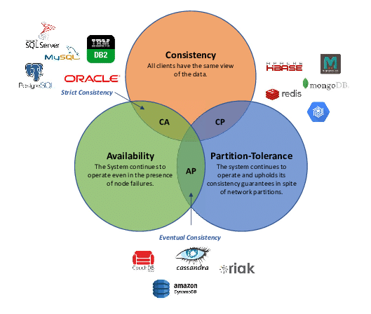

# Concepts and Design Patterns

###Recapping some design patterns and important principles

##SOLID

#### Single-responsiblity
"There should never be more than one reason for a class to change." In other words, every class should have only one responsibility.
#### Open-closed
Software component should be closed for modification, but open for extension. This means that new software getting added to the software component, should not have to modify existing code.
#### Liskov substitution
Objects should be replaceable with their subtypes without affecting the correctness of the program.
#### Interface segregation
Interfaces should only require the consumer to implement what they really need.
#### Dependency Inversion
High level functionality should not know about implementation details of low level implementations (For example how is the data stored in the database).
It needs to be abstracted via Interfaces

##ACID

#### Atomicy
A transaction is a single unit and either completely succeeds or completely fails
#### Consistency
A transaction can change a database only from one valid state to another valid state.
#### Isolation
Transactions are isolated from each other. Even if they arrive concurrently they are treated as if they arrived sequentially
#### Durability
If a transaction is a committed it will stay committed even if the database system fails in case of a power outage or crash

##CAP Theorem

#### Consistency
Every client views the same data. Every node in distributed cluster recieves same data.

#### Availability
During node failure time, every node must respond in a reasonable amount of time.

#### Partition Tolerance
Gurantees partition tolerance can recover from partitions once the partition heals.

